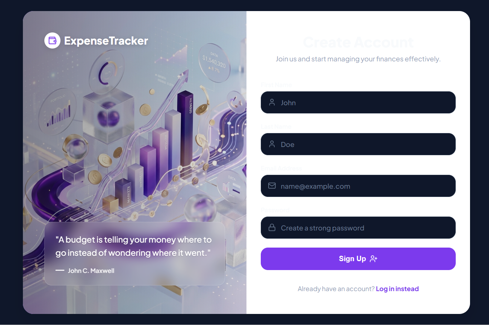
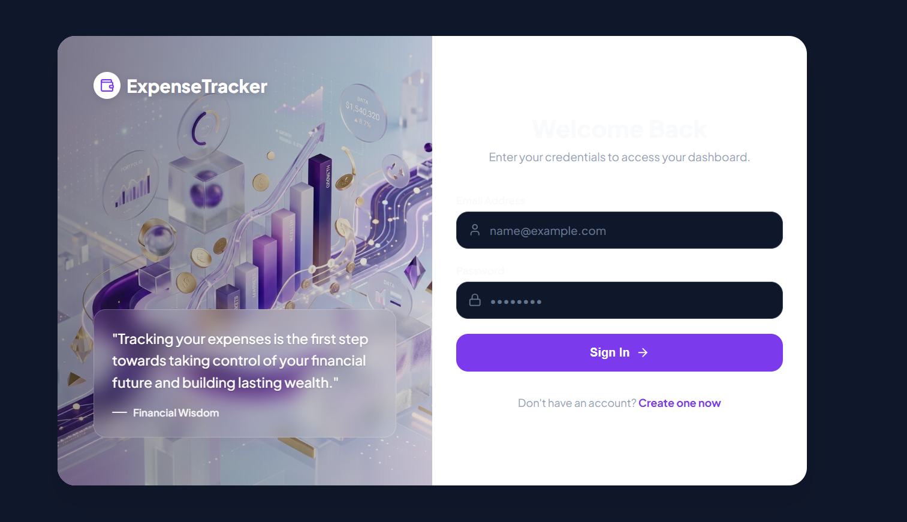
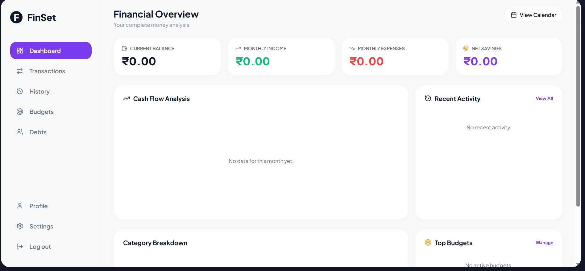
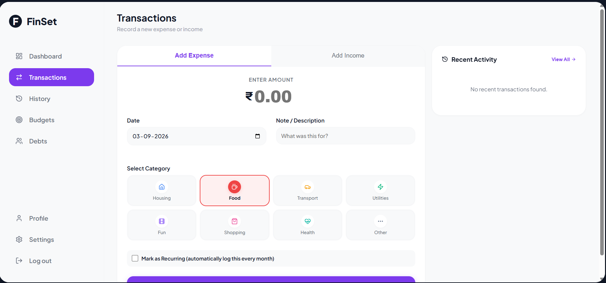
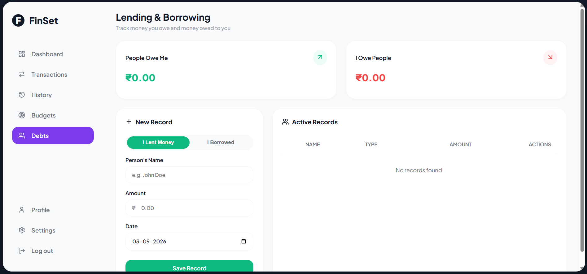

💰 FinSet — Personal Finance Tracker

A full-stack personal finance management application that helps users track income, expenses, budgets, debts, and overall financial activity through a clean and responsive dashboard.

## ✨ Features

- 🔐 User registration and JWT authentication
- 💵 Track income and expenses
- 📊 Interactive financial charts and dashboard
- 📅 Transaction history and calendar view
- 🎯 Category-based budget management
- 🤝 Track money lent and borrowed
- 🔎 Search and filter transactions
- 📄 Export transactions to CSV
- 🔁 Recurring income and expenses
- 👤 Profile and account settings
- 🌙 Dark mode
- 💱 Currency preference support
- 📱 Responsive user interface

## 📸 Screenshots

### 🎯 Register


### 🔐 Login


### 📊 Dashboard


### 💳 Transactions


### 💳 Debts


## 🛠️ Tech Stack

### Frontend

- React
- Vite
- React Router
- Axios
- Recharts
- Lucide React
- React Hot Toast
- CSS

### Backend

- Python
- Django
- Django REST Framework
- Simple JWT
- django-cors-headers

### Database

- SQLite
- PostgreSQL support

### Tools

- Git
- GitHub
- VS Code

## 📁 Project Structure

```text
FinSet/
├── backend/
│   ├── ecotrack/
│   ├── tracker/
│   ├── manage.py
│   └── requirements.txt
│
├── frontend/
│   ├── public/
│   ├── src/
│   ├── package.json
│   └── vite.config.js
│
├── README.md
├── project_report.md
├── user_manual.md
└── open_site.py


🚀 Getting Started
Prerequisites
Make sure you have:
Python 3.12+
Node.js and npm
Git

1. Clone the Repository
git clone https://github.com/Navee403/FinSet.git
cd FinSet

2. Backend Setup
Navigate to the backend:
cd backend

Create a virtual environment:
python -m venv .venv

Activate it on Windows:
.venv\Scripts\activate

Install the dependencies:
pip install -r requirements.txt

Create a .env file inside the backend directory:
SECRET_KEY=your-secret-key
DEBUG=True
ALLOWED_HOSTS=127.0.0.1,localhost
CORS_ALLOWED_ORIGINS=http://localhost:5173,http://127.0.0.1:5173

Apply migrations:
python manage.py migrate

Start the backend:
python manage.py runserver 8001

The backend will run at:
http://127.0.0.1:8001

3. Frontend Setup

Open a new terminal and navigate to:
cd frontend

Install dependencies:
npm install

Start the development server:
npm run dev

Open the URL shown by Vite, usually:
http://localhost:5173


📌 How It Works
1.Register a new account.
2.Log in using your credentials.
3.Add income and expense transactions.
4.Monitor your financial activity from the dashboard.
5.Create and track budgets.
6.Manage debts and recurring transactions.
7.Analyze your spending through charts and transaction history.


🔒 Security
Sensitive configuration such as the Django SECRET_KEY is stored in environment variables and excluded from version control.

The local SQLite database and virtual environment are also excluded from Git.

📚 Documentation
Additional documentation is available in:
 project_report.md — Project report and technical details
 user_manual.md — User guide

🚧 Future Improvements
☁️ Cloud deployment
📱 Progressive Web App support
🤖 AI-powered spending insights
📈 Advanced financial analytics
🔔 Financial reminders and notifications


👨‍💻 Author
NaveenKumar v k
GitHub: @Navee403

⭐ If you find FinSet useful, consider giving the repository a star!.